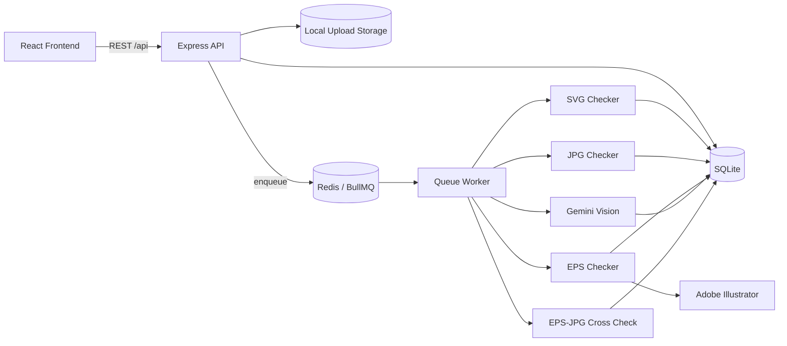
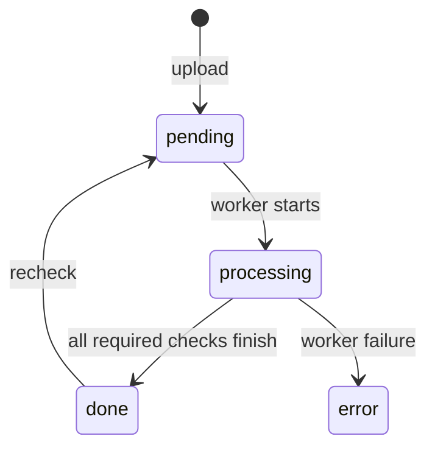
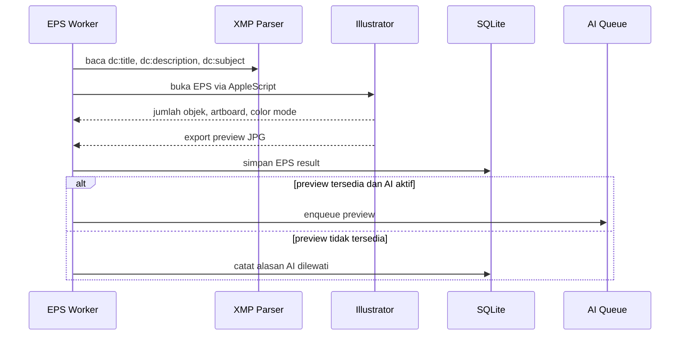

# Dokumentasi Teknis Microstock Checker

## 1. Ringkasan

Microstock Checker adalah aplikasi web lokal untuk memeriksa kesiapan aset microstock sebelum dikirim ke platform seperti Shutterstock, Adobe Stock, Freepik, Dreamstime, dan Pond5.

Aplikasi menerima berkas SVG, EPS, JPG, atau JPEG, kemudian menjalankan:

- validasi teknis sesuai aturan platform;
- ekstraksi metadata XMP dari EPS;
- pembuatan preview JPG untuk EPS;
- analisis visual menggunakan Gemini;
- perbandingan pasangan EPS dan JPG;
- pengelolaan metadata platform;
- ekspor metadata ke CSV.

Proyek menggunakan struktur monorepo npm workspaces:

- `backend/`: REST API, database, queue, worker, checker, dan integrasi AI;
- `frontend/`: antarmuka React;
- `docs/`: dokumentasi teknis.

## 2. Arsitektur



Komponen utama:

| Komponen | Teknologi | Tanggung jawab |
|---|---|---|
| Frontend | React 19, React Router, Vite | Upload, monitoring hasil, detail pemeriksaan, kategori, dan ekspor CSV |
| API | Express 5 | Upload, pembacaan hasil, preview, kategori, recheck, dan penghapusan |
| Database | SQLite, better-sqlite3 | Asset, hasil checker, cache AI, penggunaan AI, dan metadata kategori |
| Queue | BullMQ, Redis | Menjadwalkan pemeriksaan teknis, AI, dan cross-check |
| Worker | Node.js | Menjalankan checker dengan concurrency berbeda |
| EPS engine | Adobe Illustrator, AppleScript, ExtendScript | Membuka EPS, menghitung objek, dan membuat preview |
| AI | Google Gemini | Analisis risiko konten dan saran metadata |

## 3. Persyaratan Sistem

### 3.1 Persyaratan umum

- Node.js 24 direkomendasikan dan telah digunakan untuk build/test proyek.
- npm dengan dukungan workspaces.
- Redis Server.
- Google Gemini API key untuk analisis AI.
- Ruang penyimpanan lokal untuk file upload, preview, SQLite, dan Redis dump.

Node.js 18 tidak kompatibel dengan dependency frontend terkini dan dapat menyebabkan error Vite/Oxlint. Mengganti versi Node setelah `npm install` juga dapat menyebabkan ABI mismatch pada `better-sqlite3`; jalankan ulang `npm install` atau rebuild dependency menggunakan versi Node yang akan dipakai.

### 3.2 Persyaratan khusus EPS

Pemeriksaan EPS saat ini hanya berjalan pada:

- macOS;
- Adobe Illustrator terinstal dengan application name `Adobe Illustrator`;
- izin Automation macOS agar Node/terminal dapat mengontrol Illustrator;
- `osascript` tersedia.

Pemeriksaan EPS belum portabel ke Linux atau Windows karena implementasinya memakai AppleScript dan ExtendScript.

## 4. Instalasi

```bash
npm install
cp backend/.env.example backend/.env
```

Pastikan Redis berjalan:

```bash
redis-server
```

Jalankan seluruh layanan:

```bash
npm run dev
```

Perintah tersebut menjalankan:

- Express API pada `http://localhost:3001`;
- BullMQ worker;
- Vite frontend pada port yang ditampilkan terminal, biasanya `http://localhost:5173`.

Perintah parsial:

```bash
npm run dev:backend
npm run dev:frontend
npm run worker -w backend
```

## 5. Konfigurasi Environment

File konfigurasi backend berada di `backend/.env`.

| Variabel | Default | Keterangan |
|---|---:|---|
| `PORT` | `3001` | Port Express API |
| `REDIS_HOST` | `localhost` | Host Redis |
| `REDIS_PORT` | `6379` | Port Redis |
| `UPLOAD_DIR` | `./uploads` | Direktori file upload relatif terhadap proses backend |
| `GEMINI_API_KEY` | - | API key Gemini |
| `GEMINI_MODEL` | `gemini-3.5-flash` | Model yang dikirim ke Google GenAI SDK |
| `AI_DAILY_LIMIT` | `500` | Batas panggilan AI harian yang dicatat di SQLite |
| `AI_PROVIDER` | `gemini` | Dicantumkan untuk konfigurasi, tetapi implementasi checker saat ini selalu memakai Gemini |
| `OPENAI_API_KEY` | - | Belum digunakan oleh implementasi checker saat ini |

Contoh:

```env
PORT=3001
REDIS_HOST=localhost
REDIS_PORT=6379
UPLOAD_DIR=./uploads
GEMINI_API_KEY=replace_with_real_key
GEMINI_MODEL=gemini-3.5-flash
AI_PROVIDER=gemini
AI_DAILY_LIMIT=500
```

Jangan commit file `.env` atau API key.

## 6. Struktur Direktori

```text
microstock-checker/
├── backend/
│   ├── __tests__/          # Unit dan regression tests backend
│   ├── checkers/           # SVG, JPG, EPS, AI, dan cross-check
│   ├── data/               # SQLite database
│   ├── db/                 # Schema dan helper database
│   ├── queue/              # Redis connection dan BullMQ worker
│   ├── rules/              # Aturan per platform
│   ├── scripts/            # ExtendScript Adobe Illustrator
│   ├── test-fixtures/      # Fixture pengujian
│   ├── uploads/            # File upload dan preview EPS
│   ├── utils/              # Logger, metadata EPS, preview, metadata stock
│   └── server.js           # Entry point REST API
├── frontend/
│   ├── src/
│   │   ├── api/            # REST client
│   │   ├── components/     # Reusable UI components
│   │   ├── hooks/          # Polling hook
│   │   ├── pages/          # Upload, Results, Detail
│   │   ├── utils/          # Metadata fallback dan CSV platform
│   │   ├── App.jsx         # Router dan layout
│   │   └── index.css       # Global design system
│   └── vite.config.js
├── docs/
│   └── technical-documentation.md
├── package.json
└── README.md
```

## 7. Backend

### 7.1 Express API

Entry point backend adalah `backend/server.js`.

Middleware:

- `cors()` mengizinkan request lintas origin;
- `express.json()` membaca body JSON;
- Multer menyimpan upload ke `UPLOAD_DIR`.

Batas upload:

- maksimal 100 file per request;
- maksimal 200 MB per file;
- extension yang diterima: `.svg`, `.eps`, `.jpg`, `.jpeg`.

Nama file tersimpan menggunakan format:

```text
<uuid>_<original-filename>
```

Nama asli tetap disimpan di database sebagai `original_name`.

### 7.2 REST API

Base URL default:

```text
http://localhost:3001/api
```

#### Health check

```http
GET /api/health
```

Response:

```json
{
  "status": "ok",
  "redis": "connected",
  "timestamp": "2026-07-25T12:00:00.000Z"
}
```

Status API dapat tetap `ok` ketika Redis terputus; periksa field `redis`.

#### Daftar platform

```http
GET /api/platforms
```

Response:

```json
[
  {
    "platform": "shutterstock",
    "label": "Shutterstock"
  }
]
```

#### Upload

```http
POST /api/upload
Content-Type: multipart/form-data
```

Field:

| Field | Tipe | Keterangan |
|---|---|---|
| `files` | file[] | Maksimal 100 file |
| `platform` | string | ID platform, default `shutterstock` |

Response sukses:

```json
{
  "success": true,
  "count": 1,
  "assets": [
    {
      "id": "uuid",
      "originalName": "asset.eps",
      "fileType": "eps",
      "pairGroup": "asset"
    }
  ]
}
```

Setelah disimpan, API memasukkan asset ke queue berdasarkan tipe file.

#### Daftar job

```http
GET /api/jobs
```

Mengembalikan semua asset beserta hasil checker dan `overallResult`.

#### Detail job

```http
GET /api/jobs/:id
```

Response mencakup:

- data asset;
- `process_logs`;
- `metadata_categories`;
- `metadata_options`;
- `results`;
- `overallResult`.

`overallResult` hanya dihitung saat status asset `done`:

- `fail` jika minimal satu checker memiliki error;
- `warning` jika tidak ada error tetapi ada warning;
- `pass` jika tidak ada error maupun warning.

#### Simpan kategori metadata

```http
PATCH /api/jobs/:id/metadata-categories
Content-Type: application/json

{
  "categories": ["Nature", "Objects"]
}
```

Ketentuan:

- hanya tersedia untuk EPS;
- asset harus berstatus `done`;
- kategori pertama wajib;
- kategori kedua opsional;
- nilai harus berasal dari daftar platform;
- kategori tidak boleh duplikat.

#### File asli

```http
GET /api/jobs/:id/file
```

Mengirim file asli dengan MIME type berdasarkan extension.

#### Preview

```http
GET /api/jobs/:id/preview
```

- JPG/SVG menggunakan file asli;
- EPS menggunakan file `.preview.jpg`;
- resolver juga mendukung nama legacy yang spasinya diubah Illustrator menjadi `-` dan suffix `-01`/`_01`.

#### Recheck

```http
POST /api/jobs/:id/recheck
```

Recheck:

- menghapus hasil checker lama;
- mengosongkan process log;
- mengubah status menjadi `pending`;
- memasukkan job baru dengan `forceAiRefresh: true`.

Pilihan kategori manual tidak dihapus saat recheck.

#### Hapus

```http
DELETE /api/jobs/:id
DELETE /api/jobs
```

Penghapusan menghapus:

- file upload;
- seluruh kandidat nama preview EPS;
- record database terkait melalui foreign key cascade.

### 7.3 Database

Database default:

```text
backend/data/microstock.db
```

SQLite menggunakan:

- WAL journal mode;
- foreign keys;
- migrasi ringan berbasis `ALTER TABLE` saat backend dimuat.

#### Tabel `assets`

| Kolom | Keterangan |
|---|---|
| `id` | UUID asset |
| `original_name` | Nama file dari pengguna |
| `file_path` | Path file di disk |
| `file_type` | `svg`, `eps`, atau `jpg` |
| `file_size` | Ukuran byte |
| `platform` | ID aturan platform |
| `pair_group` | Basename lowercase untuk pairing EPS/JPG |
| `status` | `pending`, `processing`, `done`, atau `error` |
| `process_logs` | JSON array aktivitas |
| `metadata_categories` | JSON array kategori manual |
| `created_at` | Waktu pembuatan |
| `updated_at` | Waktu perubahan |

#### Tabel `check_results`

Satu asset dapat memiliki beberapa hasil:

- `svg`;
- `eps`;
- `jpg`;
- `ai_content`;
- `cross_check`.

`errors`, `warnings`, dan `info` disimpan sebagai JSON text.

#### Tabel `ai_cache`

Cache menggunakan hash SHA-256 dari:

- versi cache;
- platform;
- konfigurasi metadata platform;
- isi file target.

Tujuannya mencegah hasil metadata platform lain atau schema lama dipakai ulang.

#### Tabel `ai_usage`

Menyimpan jumlah panggilan AI per tanggal. Counter bertambah setelah response Gemini berhasil diparse.

### 7.4 Rules platform

Rule berada di `backend/rules/*.json` dan dimuat oleh `rules/loader.js`.

Struktur umum:

```json
{
  "platform": "shutterstock",
  "label": "Shutterstock",
  "jpg": {},
  "eps": {},
  "svg": {},
  "aiContent": {},
  "metadata": {}
}
```

Menambahkan platform baru:

1. buat file JSON baru;
2. gunakan `platform` yang unik;
3. isi aturan teknis dan AI;
4. restart backend dan worker.

Rule disimpan dalam memory cache. Fungsi `reloadRules()` tersedia tetapi belum diekspos sebagai API.

### 7.5 Queue dan worker

Queue:

| Queue | Concurrency | Keterangan |
|---|---:|---|
| `svg-check` | 5 | Parsing dan validasi SVG |
| `jpg-check` | 5 | Metadata dan validasi JPG |
| `eps-check` | 1 | Illustrator single-instance |
| `ai-check` | 2 | Gemini Vision |
| `cross-check` | 3 | Perbandingan EPS/JPG |

AI queue memiliki limiter 10 job per menit. Batas harian terpisah dikendalikan `AI_DAILY_LIMIT`.

Status asset:



Worker memiliki listener `failed` dan `error`. Job failure yang membawa `assetId` mengubah status asset menjadi `error` dan menambahkan process log.

### 7.6 Pemeriksaan SVG

`backend/checkers/svg.js` memakai streaming SAX parser.

Data yang diperiksa antara lain:

- root SVG valid;
- viewBox/width/height;
- live text;
- embedded raster/image;
- jumlah path;
- dimensi minimum;
- batas kompleksitas sesuai rule.

Checker tidak membutuhkan browser atau aplikasi eksternal.

### 7.7 Pemeriksaan JPG

`backend/checkers/jpg.js` memakai Sharp.

Data yang diperiksa:

- file dapat dibaca;
- format benar-benar JPEG;
- width dan height;
- color space;
- channel, density, dan alpha;
- resolusi minimum;
- ukuran maksimum rekomendasi.

Jika AI aktif, file JPG langsung dikirim ke AI queue.

### 7.8 Pemeriksaan EPS

Alur EPS:



`backend/scripts/checkVector.jsx` dijalankan di Illustrator untuk mengambil:

- jumlah text frame;
- raster item;
- placed item;
- path dan compound path;
- group dan layer;
- ukuran artboard;
- color mode;
- objek di luar artboard;
- ukuran file;
- preview JPG.

Eksekusi memiliki:

- timeout 120 detik;
- maksimal dua percobaan;
- force-kill Illustrator ketika timeout;
- concurrency satu.

Preview diekspor ke temporary path tanpa spasi, lalu disalin ke canonical path di folder upload.

### 7.9 Metadata XMP EPS

`backend/utils/eps-metadata.js` membaca paket XMP langsung dari EPS tanpa membutuhkan ExifTool.

Field:

| XMP | Hasil checker |
|---|---|
| `dc:title` | `metadataTitle` |
| `dc:description` | `metadataDescription` |
| `dc:subject` | `metadataKeywords` |

Parser:

- membaca file per chunk 64 KB;
- membatasi paket XMP maksimum 5 MB;
- memilih nilai berbahasa `x-default`;
- menghapus keyword duplikat secara case-insensitive;
- mengembalikan metadata kosong jika XMP tidak ada atau rusak.

### 7.10 Analisis AI

`backend/checkers/ai-content.js` memakai `@google/genai`.

Input:

- JPG asli untuk asset JPG;
- preview JPG untuk EPS.

Output mencakup:

- trademark/IP risk;
- sensitive content;
- indikasi AI-generated;
- similar content/spam risk;
- kualitas komersial;
- suggested title;
- suggested description;
- suggested keywords;
- suggested categories;
- confidence.

Saran metadata dinormalisasi oleh `stock-metadata.js`:

- description maksimum sesuai platform;
- keyword dideduplikasi dan dibatasi;
- kategori dicocokkan ke daftar canonical;
- maksimal kategori mengikuti rule platform.

AI failure tidak menggagalkan pemeriksaan teknis. Hasil AI akan berisi warning `AI_CHECK_FAILED`, `AI_NOT_CONFIGURED`, atau `AI_LIMIT_REACHED`.

### 7.11 Cross-check EPS dan JPG

EPS dan JPG dianggap pasangan jika basename tanpa extension sama secara lowercase.

Contoh:

```text
autumn-border.eps
autumn-border.jpg
```

Cross-check membandingkan aspect ratio artboard EPS dengan JPG. Toleransi perbedaan adalah 2%. Hasil disimpan pada kedua asset.

## 8. Frontend

### 8.1 Router

| Route | Halaman | Fungsi |
|---|---|---|
| `/` | `Upload.jsx` | Memilih platform dan upload file |
| `/results` | `Results.jsx` | Ringkasan, filter, selection, delete, ekspor |
| `/results/:id` | `Detail.jsx` | Preview, log, hasil checker, metadata, kategori |

`ToastProvider` membungkus seluruh aplikasi.

### 8.2 REST client

`frontend/src/api/client.js` menggunakan Fetch API.

Base URL saat ini hardcoded:

```js
const API_BASE = 'http://localhost:3001/api';
```

Untuk deployment nonlokal, pindahkan nilai ini ke environment Vite, misalnya `VITE_API_BASE_URL`.

### 8.3 Halaman Upload

Fungsi:

- mengambil daftar platform dari API;
- drag-and-drop atau file picker;
- mencegah duplikat berdasarkan nama dan ukuran;
- mengelompokkan EPS/JPG berdasarkan basename;
- upload beberapa file sekaligus;
- navigasi ke halaman hasil setelah enqueue berhasil.

Validasi extension juga dilakukan oleh `DropZone`, tetapi backend tetap menjadi authority.

### 8.4 Halaman Results

Data dipoll setiap tiga detik melalui `usePolling`.

Fitur:

- filter pass/warning/fail/pending;
- pencarian nama file;
- selection individual atau semua yang terlihat;
- delete satu, beberapa, atau seluruh job;
- dropdown ekspor platform;
- summary status.

Format ekspor metadata yang aktif adalah Shutterstock dan Adobe Stock. Freepik, Dreamstime, dan Pond5 masih tampil sebagai rencana lanjutan.

### 8.5 Halaman Detail

Halaman detail juga mengambil data ulang setiap tiga detik.

Fitur:

- preview asset;
- overall status dan guidance;
- process log;
- bagian hasil setiap checker;
- detail error/warning;
- saran AI;
- embedded EPS metadata;
- recheck;
- delete;
- pengaturan kategori platform untuk EPS selesai.

Jumlah kategori mengikuti rule platform. Shutterstock menerima maksimal dua kategori, sedangkan Adobe Stock menerima satu. Pilihan disimpan melalui API.

### 8.6 Komponen utama

| Komponen | Fungsi |
|---|---|
| `DropZone` | Drag-and-drop dan file input |
| `ResultTable` | Tabel hasil dan selection |
| `StatusBadge` | Status visual |
| `JobProgress` | Tahap proses |
| `IssueExplanation` | Penjelasan issue dan tindakan |
| `Toast` | Feedback nonblocking |
| `ExportCsvMenu` | Pemilihan format platform |
| `CategorySettings` | Pilihan kategori persisten sesuai batas platform |

### 8.7 Ekspor CSV Shutterstock

File output:

```text
shutterstock_content_upload.csv
```

Kolom:

| Kolom | Sumber |
|---|---|
| `Filename` | `original_name` |
| `Description` | XMP EPS description, lalu AI description/title |
| `Keywords` | XMP EPS keywords, lalu AI keywords |
| `Categories` | kategori manual, lalu kategori AI |
| `Editorial` | `no` |
| `Mature content` | hasil sensitive-content AI |
| `illustration` | `yes` untuk EPS/SVG, `no` untuk JPG |

Fallback dilakukan per field. Contoh: jika EPS memiliki keywords tetapi description kosong, keywords tetap memakai XMP sedangkan description memakai AI.

Validasi akhir:

- description dipotong ke 200 karakter;
- keywords dideduplikasi dan dibatasi 50;
- kategori hanya dari daftar Shutterstock;
- kategori dibatasi dua;
- CSV memakai CRLF, escaping RFC-style, UTF-8, dan BOM.

### 8.8 Ekspor CSV Adobe Stock

File output:

```text
adobe_stock_content_upload.csv
```

Kolom:

| Kolom | Sumber |
|---|---|
| `Filename` | `original_name` |
| `Title` | XMP EPS title, lalu AI title/description |
| `Keywords` | XMP EPS keywords, lalu AI keywords |
| `Category` | kode numerik dari kategori manual, lalu kategori AI |
| `Releases` | kosong karena aplikasi belum mengelola model/property releases |

Validasi akhir:

- title dipotong ke 200 karakter;
- keywords diurutkan sesuai sumber, dideduplikasi, dan dibatasi 49;
- hanya satu kategori;
- nama kategori dipetakan ke kode numerik resmi;
- CSV memakai header dan urutan kolom sesuai sample Adobe Stock.

Kode kategori:

| Kode | Kategori | Kode | Kategori |
|---:|---|---:|---|
| 1 | Animals | 12 | Lifestyle |
| 2 | Buildings and Architecture | 13 | People |
| 3 | Business | 14 | Plants and Flowers |
| 4 | Drinks | 15 | Culture and Religion |
| 5 | The Environment | 16 | Science |
| 6 | States of Mind | 17 | Social Issues |
| 7 | Food | 18 | Sports |
| 8 | Graphic Resources | 19 | Technology |
| 9 | Hobbies and Leisure | 20 | Transport |
| 10 | Industry | 21 | Travel |
| 11 | Landscapes |  |  |

## 9. Testing dan Quality Checks

Jalankan seluruh unit test:

```bash
node --test backend/__tests__/*.test.js frontend/src/utils/shutterstockCsv.test.js
```

Frontend lint:

```bash
npm run lint -w frontend
```

Frontend production build:

```bash
npm run build -w frontend
```

Syntax check backend:

```bash
node --check backend/server.js
node --check backend/queue/worker.js
node --check backend/checkers/ai-content.js
```

Test mencakup:

- SVG valid/corrupt/live text/embedded raster;
- resolver preview EPS;
- parser XMP EPS;
- normalisasi metadata;
- validasi kategori manual;
- Shutterstock dan Adobe Stock CSV mapping, escaping, limit, kategori, dan fallback AI.

## 10. Logging dan Observability

Logger berada di `backend/utils/logger.js`.

Setiap log memiliki:

- level;
- timestamp ISO;
- context.

Process log per asset disimpan di `assets.process_logs` dan ditampilkan di halaman detail.

Health endpoint hanya memeriksa koneksi Redis secara singkat. Belum tersedia:

- metrics endpoint;
- queue dashboard;
- distributed tracing;
- structured log persistence.

## 11. Troubleshooting

### Redis disconnected

Gejala:

- health endpoint menampilkan `redis: disconnected`;
- upload tersimpan tetapi queue tidak diproses;
- worker mengeluarkan connection error.

Periksa:

```bash
redis-cli ping
```

Response yang benar adalah `PONG`.

### `better_sqlite3.node` ABI mismatch

Penyebab: dependency native diinstal menggunakan versi Node berbeda.

Perbaikan:

```bash
rm -rf node_modules
npm install
```

Gunakan versi Node yang sama untuk install, server, worker, test, dan build.

### `Preview belum tersedia`

Periksa:

- EPS worker selesai;
- Illustrator berhasil export JPG;
- file `.preview.jpg` ada di `backend/uploads`;
- backend dan worker sudah direstart setelah perubahan kode.

Resolver mendukung normalisasi nama Illustrator, tetapi job lama mungkin perlu recheck agar `previewPath` tersimpan.

### AI EPS tidak berjalan

AI EPS membutuhkan preview. Lihat process log:

```text
AI content analysis skipped because no EPS preview was found
```

Periksa juga:

- `GEMINI_API_KEY`;
- `AI_DAILY_LIMIT`;
- Redis;
- worker aktif;
- model Gemini valid.

### Illustrator timeout

Penyebab umum:

- dialog Illustrator menunggu input;
- izin Automation belum diberikan;
- file EPS kompleks/rusak;
- Illustrator instance macet.

Checker mencoba dua kali dan dapat menutup paksa Illustrator saat timeout.

### `EMFILE: too many open files, watch`

Terjadi ketika mode `node --watch` melewati batas file descriptor.

Alternatif:

```bash
npm start -w backend
npm run worker -w backend
npm run dev -w frontend
```

### Kategori tidak muncul

Kategori hanya ditampilkan ketika:

- file bertipe EPS;
- status asset `done`;
- platform memiliki `metadata.imageCategories`.

Restart backend diperlukan setelah perubahan rule atau schema.

## 12. Security dan Batasan Produksi

Proyek saat ini berorientasi penggunaan lokal. Sebelum deployment publik, perhatikan:

- belum ada authentication/authorization;
- CORS masih terbuka;
- endpoint delete tidak memiliki proteksi tambahan;
- frontend memakai API URL hardcoded;
- file disimpan di local filesystem;
- belum ada antivirus/malware scanning;
- validasi upload berdasarkan extension, bukan signature penuh untuk semua format;
- tidak ada rate limit API umum;
- API key berada di environment backend;
- tidak ada HTTPS termination;
- SQLite dan Redis dump perlu backup;
- Adobe Illustrator automation membutuhkan desktop session aktif.

Untuk production, pertimbangkan object storage, reverse proxy, restricted CORS, auth, API rate limiting, file signature validation, centralized logs, dan deployment worker terpisah.

## 13. Panduan Pengembangan

Saat menambah checker:

1. buat modul di `backend/checkers`;
2. kembalikan contract `{ valid, errors, warnings, info }`;
3. tambahkan queue/worker;
4. simpan hasil melalui `insertCheckResult`;
5. tambahkan label frontend;
6. tambahkan test.

Format issue:

```json
{
  "code": "STABLE_MACHINE_READABLE_CODE",
  "message": "Human-readable explanation"
}
```

Saat menambah format CSV platform:

1. buat utility exporter terpisah;
2. gunakan header resmi platform;
3. validasi constraint setelah fallback metadata;
4. tambahkan pilihan aktif di `ExportCsvMenu`;
5. tambahkan unit test untuk mapping dan escaping;
6. gunakan filename output yang sesuai dokumentasi platform.

## 14. Known Limitations

- EPS checker hanya macOS + Illustrator.
- AI provider aktual hanya Gemini.
- Ekspor CSV belum tersedia untuk Freepik, Dreamstime, dan Pond5.
- Category manual baru tersedia untuk EPS.
- Pairing hanya berdasarkan basename identik.
- Cross-check baru membandingkan aspect ratio.
- Polling frontend berjalan terus setiap tiga detik.
- Tidak ada pagination untuk daftar job.
- Tidak ada cleanup otomatis file/job lama.
- Tidak ada retry policy BullMQ khusus selain retry internal EPS dan AI.
